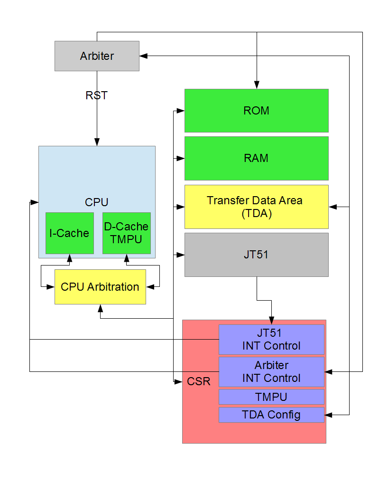

What is YMSoC
=============

YMSoC is a vanity project for testing out the recently developed JT51, a
Verilog implementation of the YM2151 FM Synthesis chip. I've always been
interested in their sound, and I figured creating a CPU interface to play
with one would be a fun task (for some metric of fun).

YMSoC also can serve as an example of how to create a System-On-a-Chip (SoC)
using the Migen DSL and MiSoC. Migen generates Verilog HDL and abstracts
away various mistakes I tend to make while writing Verilog directly. MiSoC provides
a mechanism to generate a CPU with various I/O peripherals, including a timer,
UART, and SDRAM controller.

In my case, since Yamaha chips provide their own GPIO and timers, I create
my own peripherals talking over a Wishbone bus. I use MiSoC for other
features, such as easily connecting Wishbone bus components, interrupt controller
and connection generations, and C header generation for firmware development.

YMSoC should fit just fine on a Xilinx Spartan 6 LX9 or equivalent, and at some
point I may make my own board dedicated solely to this design. I also leave
open the possibility of using YMSoC in a larger game console or arcade-like
design by using an Arbiter peripheral at the top level.

Currently YMSoC supports the mimasv2 and minispartan6 development boards. Adding
support for a new board in Migen/YMSoC is easy, and I can be persuaded to do it for
you if interested.

Block Diagram
=============

   Block diagram of a generic YMSoC design.
